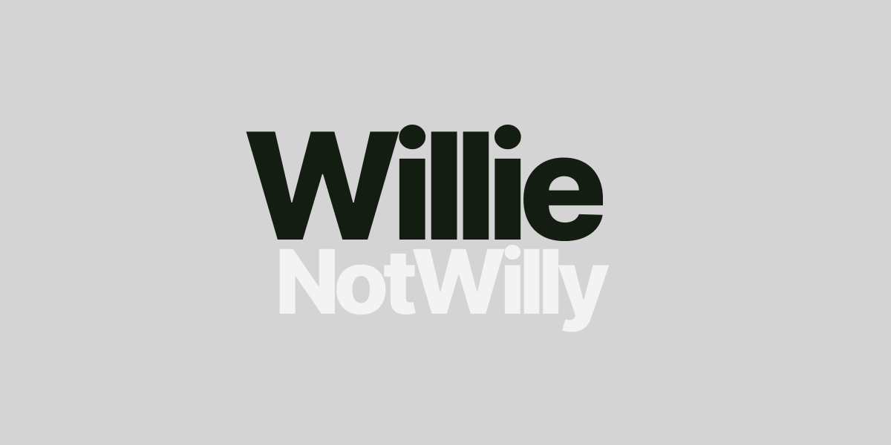

# willienotwilly



Personal site, portfolio, MDX blog, and small lab for creative tooling experiments. Built with Next.js App Router, Tailwind CSS, MDX, Supabase-backed interactions, and a pile of lovingly weird visual tests.

[](https://nextjs.org/)
[](https://react.dev/)
[](https://tailwindcss.com/)
[](LICENSE)

## What is this?

This repo is the source for [willienotwilly.com](https://willienotwilly.com): a quiet portfolio/blog shell for documenting projects, experiments, prompts, charts, demos, and notes. It is intentionally small enough to fork and customize, but has enough structure to hold a real body of work.

The useful bits:

- MDX blog posts in `app/blog/posts`
- Portfolio case studies powered by structured data in `lib/portfolio.ts`
- Site-wide identity and metadata in `lib/site.ts`
- Reusable UI components in `components/ui`
- Chart and voting demos for the "That's Not The Rock" benchmark
- Lab routes for interaction prototypes, including the color picker experiments
- Optional Supabase routes for subscriptions and voting

## Quick start

```bash
npm install
cp .env.example .env.local
npm run dev
```

Open [http://localhost:3000](http://localhost:3000).

## Customizing it

Most personal details live in one place:

```ts
// lib/site.ts
export const siteConfig = {
  name: "Willie Falloon",
  url: "https://willienotwilly.com",
  links: {
    x: "https://x.com/ReflctWillie",
    linkedin: "https://www.linkedin.com/in/willie-falloon-961a8a68/",
  },
};
```

To make the site your own:

1. Update `lib/site.ts` with your name, links, metadata, and homepage copy.
2. Replace images and videos in `public/`, especially `public/willienotwilly-og.jpg`.
3. Add or remove posts in `app/blog/posts`.
4. Edit portfolio entries in `lib/portfolio.ts`.
5. Set `NEXT_PUBLIC_SITE_URL` in `.env.local` for canonical URLs and sitemaps.

## Environment variables

Only `NEXT_PUBLIC_SITE_URL` is important for a polished deployment. Everything else is optional.

| Variable | Purpose |
| --- | --- |
| `NEXT_PUBLIC_SITE_URL` | Canonical site URL used by metadata, sitemap, and robots. |
| `NEXT_PUBLIC_ASSETS_BASE_URL` | Optional CDN/R2 base URL for media stored outside `public/`. |
| `NEXT_PUBLIC_ROCK_BENCH_R2_URL` | Optional image base URL for the rock benchmark voting UI. |
| `NEXT_PUBLIC_SUPABASE_URL` | Optional Supabase project URL for subscribe/vote APIs. |
| `NEXT_PUBLIC_SUPABASE_ANON_KEY` | Optional Supabase anon key for subscribe/vote APIs. |

## Project structure

```txt
app/                  Next.js App Router routes
app/blog/posts/       MDX posts and frontmatter
components/           UI, media, charts, portfolio, and lab components
lib/                  Site config, MDX helpers, data, and utilities
public/               Static images, videos, resume, and data files
scripts/              Upload helpers for media/data workflows
remotion/             Video/data experiments
```

## Scripts

```bash
npm run dev      # Start the local development server
npm run lint     # Run ESLint
npm run build    # Create a production build
npm run start    # Serve the production build locally
```

## Content notes

MDX posts are read by `lib/mdx.ts`, sorted by frontmatter date, and rendered at `/:slug`. A minimal post looks like this:

```mdx
---
title: "My experiment"
date: "2026-05-19"
summary: "A short description for feeds and metadata."
---

Post content goes here.
```

Portfolio entries are plain TypeScript data in `lib/portfolio.ts`, which keeps routes simple and makes it easy to add richer media without turning the page component into a filing cabinet.

## Deployment

The app is ready for Vercel, but any Node-compatible Next.js host should work.

Before shipping:

```bash
npm run lint
npm run build
```

Then set `NEXT_PUBLIC_SITE_URL` to your production domain. If you serve media from a separate asset domain, set `NEXT_PUBLIC_ASSETS_BASE_URL` and add that host to `next.config.ts` image remote patterns.

## License

MIT. See [LICENSE](LICENSE).
